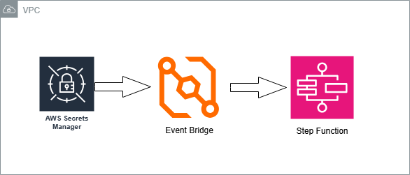
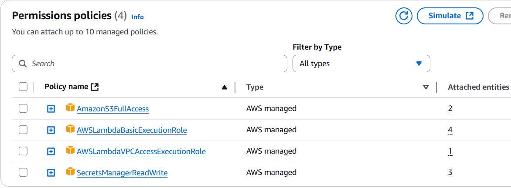
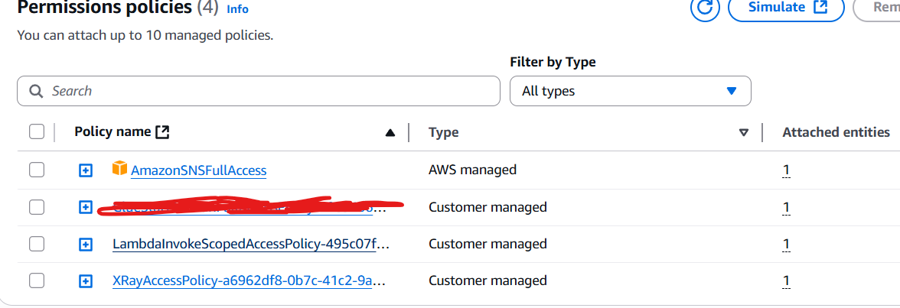
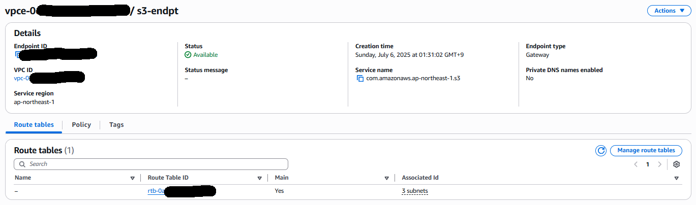
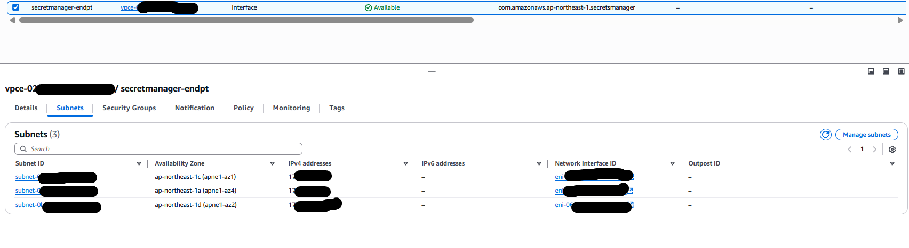
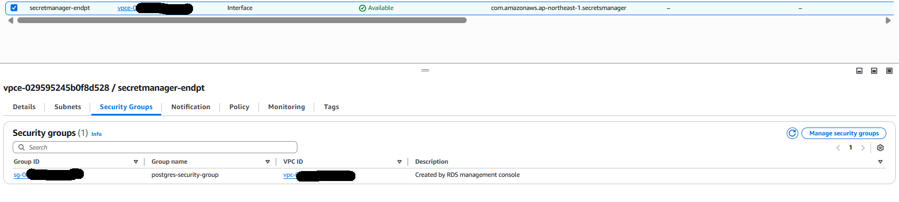
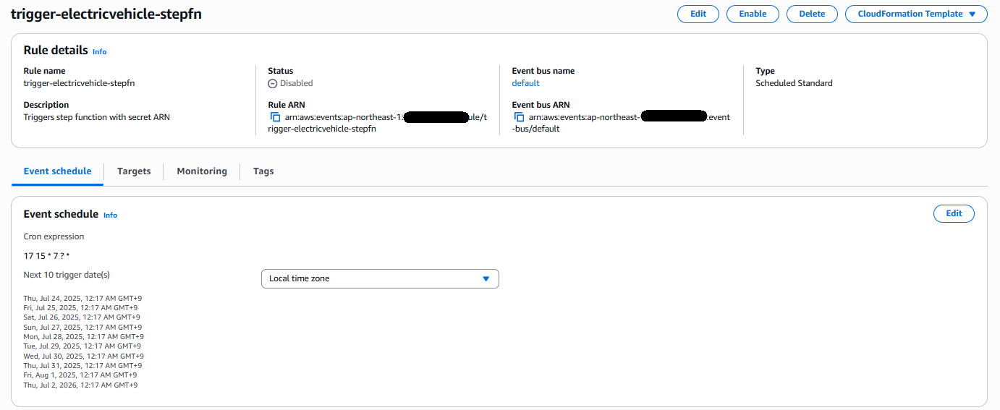
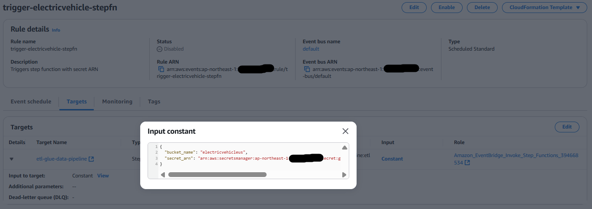

# 🚗 US EV Data – AWS ETL Project

## 📘 Project Description

This project focuses on analyzing the population of electric vehicles (EVs) across the United States using publicly available data from Washington State’s Open Data portal. The dataset includes details such as VIN, vehicle make and model, model year, electric range, vehicle type, and registration location (state, county, city).

Washington State’s Open Data Portal link - https://data.wa.gov/Transportation/Electric-Vehicle-Population-Data/f6w7-q2d2/data_preview

The goal of the project is to build an automated AWS data pipeline that ingests, transforms, and stores this dataset for further analysis, providing insights to data analysts, policymakers, and EV enthusiasts.

---

## 🏗️ Architecture Overview

This project leverages a fully serverless, event-driven architecture within a secure VPC on AWS (Tokyo region) to automate the ingestion and analysis of U.S. electric vehicle data.

---

## 🔧 Key AWS Components

| AWS Service               | Purpose                                                                               |
|---------------------------|---------------------------------------------------------------------------------------|
| AWS Secrets Manager       | Stores S3 bucket name and PostgreSQL credentials                                      |
| Amazon EventBridge        | Triggers the pipeline on schedule and injects secrets as payload to Step Function     |
| AWS Step Functions        | Orchestrates the entire ETL process                                                   |
| AWS Lambda                | Extracts data, store it in S3, transform the data and loads it into PostgreSQL        |
| Amazon SNS                | Sends success/failure notifications                                                   |
| Amazon RDS (PostgreSQL)   | Stores cleaned and structured EV data                                                 |
| Amazon S3                 | Temporary storage for raw data, stored as csv file                                    |
| Amazon CloudWatch         | Logs for Lambda, Step Functions, and monitoring                                       |
| VPC + Endpoints           | Ensures secure communication within the AWS environment                               |

---

## 🔁 Workflow Summary

1. Scheduling & Triggering

   EventBridge triggers the Step Function, passing secrets from Secrets Manager.

2. Extraction Phase

   Lambda fetches EV data from the public API and stores it in S3. SNS sends a notification on success or failure.

3. Loading Phase

   Another Lambda reads the S3 file, transforms the data and loads data into the RDS PostgreSQL instance. A final SNS alert confirms success or failure.

4. Security

   All services are deployed inside a VPC with appropriate security groups and private endpoints for Secrets Manager and S3.

---

## 🔒 Security

All services are deployed inside a VPC with appropriate security groups and private endpoints for Secrets Manager and S3.

---

## 📊 Architecture Diagram

Below architecture diagram is as overview of the architecture for the ETL project.

---

## 🧰 Tech Stack

This project was implemented using a combination of Python-based data processing and AWS serverless components to construct an end-to-end ETL pipeline for electric vehicle data ingestion and analysis.

### Programming Language

- Python 3.12

### Python Libraries

- requests – For HTTP GET requests to the public API  
- pandas – Data manipulation and transformation  
- boto3 – AWS SDK for Python, used for interacting with S3 and Secrets Manager  
- sqlalchemy – For constructing and managing the PostgreSQL connection string  
- psycopg2 – PostgreSQL database driver used for executing queries  
- json, io, os, logging, datetime, unittest – Standard libraries for auxiliary tasks such as logging, environment variable handling, and in-memory stream management  

### AWS Services

| AWS Service                         | Purpose                                                                                             |
|-------------------------------------|-----------------------------------------------------------------------------------------------------|
| AWS Lambda                          | Serverless compute functions for data extraction and loading                                       |
| Amazon S3                           | Temporary staging area for raw data in CSV/JSON format                                             |
| Amazon RDS (PostgreSQL 13.20)       | Persistent relational database for structured EV data                                               |
| AWS Secrets Manager                 | Secure storage for database credentials and S3 bucket name                                          |
| AWS Step Functions                  | Workflow orchestration to manage the ETL process                                                    |
| Amazon EventBridge                  | Scheduled trigger to initiate the workflow                                                          |
| Amazon SNS                          | Notification service for success/failure alerts                                                     |
| Amazon CloudWatch                   | Monitoring and log aggregation for all execution components                                         |
| VPC, Security Groups, and Endpoints | Used to isolate and secure service interactions within a private network                            |

### Deployment

- Manual Configuration – All AWS resources were provisioned and configured manually via the AWS Management Console; no infrastructure-as-code tools (e.g., Terraform, CloudFormation, or CDK) were used.

## 🚀 Features

⏰ Scheduled Data Pipeline – Automatically triggered using Amazon EventBridge on a defined schedule

🌐 API-Based Data Extraction – Pulls real-time electric vehicle registration data from Washington’s open data API

🪄 Automated ETL Workflow – Serverless workflow using AWS Step Functions and Lambda

🗂️ Intermediate Data Storage – Saves raw JSON/CSV to Amazon S3 before loading to RDS

🧠 Data Transformation – Cleans and reshapes the dataset using Pandas before database ingestion

🛡️ Secure Credential Handling – Uses AWS Secrets Manager for storing S3 and RDS credentials securely

📬 Success/Failure Notifications – Notifies via Amazon SNS after each pipeline step

🔐 Private Network – All services are deployed within a VPC using interface endpoints for enhanced security

📈 PostgreSQL Data Warehouse – Final transformed data is stored in RDS for downstream querying and visualization

📄 Logged and Monitored – All Lambda and pipeline execution logs are available via CloudWatch

## 🧪 How to Run the Project

This project runs automatically on a scheduled basis using Amazon EventBridge to trigger a Step Functions workflow that orchestrates two AWS Lambda functions. The pipeline performs data extraction, transformation, and loading into an Amazon RDS PostgreSQL database.

---

### ✅ Prerequisites

#### 📦 AWS Resources Required

- **Amazon S3 bucket** – To temporarily store raw and processed EV data files.  
- **Amazon RDS (PostgreSQL 13.20)** – For storing the final transformed dataset.  
- **AWS Secrets Manager** – Stores:  
  - S3 bucket name  
  - PostgreSQL host, username, password, database name  
- **Amazon SNS** – Sends success/failure alerts after each step.  
- **Step Functions** – Orchestrates the ETL process.  
- **EventBridge** – Triggers the Step Function on a schedule.  
- **CloudWatch** – Captures logs and execution metrics.  
- **AWS Lambda (x2)** –  
  - Lambda 1: Extract and store to S3  
  - Lambda 2: Load data to RDS  

---

### 🔐 IAM Configuration

Each Lambda function should use an IAM Role with the following minimum permissions.
Lambda function uses below IAM roles.

Step function uses below IAM roles

---

### 🛡️ VPC & Security Settings
Add screenshot

#### 🔐 Security Group for RDS:

- Allow inbound traffic from the Lambda's security group on port `5432` (PostgreSQL default)  
- No public access to RDS instance  

#### 🌐 VPC Endpoints (Interface):

To ensure secure and private communication within your VPC:

- `com.amazonaws.<region>.s3` – For accessing S3 from Lambda

    
- `com.amazonaws.<region>.secretsmanager` – For fetching secrets  

---

### 🕒 Scheduling with EventBridge

Create a Rule in EventBridge with your desired cron expression.

## 📸 Execution Evidence – Suggested Screenshots

### ✅ Orchestration Layer

**EventBridge Rule**  
- Screenshot of your cron rule triggering the Step Function  
- Show the event pattern or schedule expression  

**Step Function Execution**  
- State machine flow with a successful execution trace  
- Show timestamp and green checkmarks for each Lambda step  
- Optionally: failed state (when using retry/catch)  

---

### ⚙️ ETL Steps

**Lambda Logs in CloudWatch**  
Logs showing:  
- `requests.get()` successfully fetched data  
- File stored to raw S3 path  
- Transformation summary (e.g., columns transformed, nulls handled)  
- Final confirmation that output was uploaded to processed/  

**S3 Buckets**  
- `raw/` bucket: Show the JSON/CSV file  
- `processed/` bucket: Transformed CSV or summary file  
- Include timestamps to show the job is periodic  

---

### 📊 Output and Results

**Summary Stats Output**  
- Screenshot of CSV preview (e.g., top 10 EV makes, models, etc.)  
- Optional: Table/graph screenshot if you’ve visualized the results locally  
