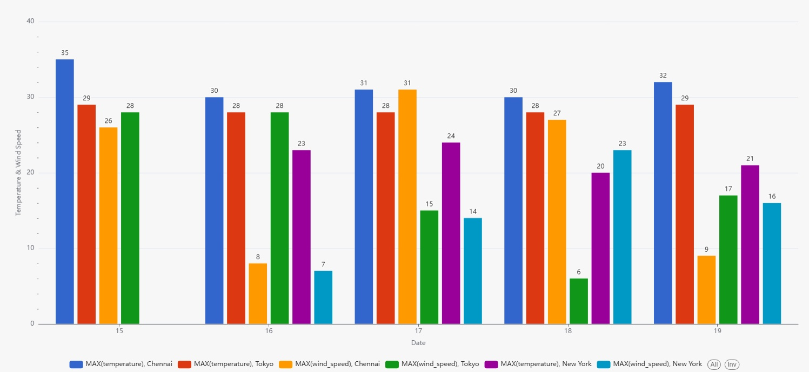

# Weather Data ETL Pipeline

## 📘 Project Overview
This project implements a fully containerized data pipeline for automating the extraction, storage, transformation, and visualization of weather data.  
Weather data is extracted from the [Weatherstack API](https://weatherstack.com/) and ingested into a **Postgres** database as raw JSON. Using **dbt**, the raw data is cleaned, structured, and aggregated into analytics-ready models. The entire workflow is orchestrated with **Apache Airflow**, ensuring automated scheduling and monitoring. Finally, the curated datasets are visualized in **Apache Superset** dashboards for insights into daily and historical weather trends.  

The pipeline is designed for **reproducibility, scalability, and easy deployment**, all running seamlessly inside **Docker containers**.

## 🚀 Features

- **Automated Orchestration**: Apache Airflow schedules and manages the pipeline.  
- **Containerized Deployment**: Docker ensures easy setup and reproducibility.  
- **Reliable Data Ingestion**: Weatherstack API data stored as raw JSON in Postgres.  
- **Structured Transformations**: dbt cleans and aggregates data into analytics-ready tables.  
- **Interactive Dashboards**: Superset visualizations for trend analysis and reporting.  
- **Scalable & Extensible**: Easily add new locations, parameters, or data sources.  
- **Reproducible & Reliable**: Idempotent ingestion and dbt tests ensure data quality.

## 🏗️ Architecture Overview

The pipeline follows an **Extract → Load → Transform → Visualize** workflow:


## 🔁 Workflow Details

### 1. Orchestration
- The entire pipeline is orchestrated by **Apache Airflow**, which schedules and monitors all steps automatically.  
- Airflow triggers the data ingestion and transformation tasks, including running the dbt container for transformations.

### 2. Extract & Load
- `api_request.py` fetches weather data from the Weatherstack API, using the API key stored within the script.  
- `insert_data.py` connects to Postgres via **psycopg2**, creates the `dev.raw_weather_data` table if it doesn’t exist, and inserts the raw JSON data fetched by `api_request.py`.

### 3. Transform
- `sources.yml` defines the structure and column names for `dev.raw_weather_data`, serving as the blueprint for dbt transformations.  
- `stg_weather_data` is created by cleaning, deduplicating, and standardizing the raw data.  
- Two analytics-ready tables (data marts) are generated:  
  - `daily_average` → aggregates daily weather metrics  
  - `weather_report` → curated dataset for reporting and dashboards

### 4. Visualize
- Apache Superset connects to Postgres and builds interactive dashboards using the daily_average and weather_report tables.

## 🧪 Setup & Running Locally

```bash
### 1. Clone the Repository
git clone <repo-url>
cd <repo-folder>

### 2. Configure Environment Variables
Refer the .env file and replace variable as required:
WEATHERSTACK_API_KEY=your_api_key
POSTGRES_USER=your_db_user
POSTGRES_PASSWORD=your_db_password
POSTGRES_DB=your_db_name
POSTGRES_HOST=postgres
POSTGRES_PORT=5432

### 3. Start Services with Docker Compose
docker-compose up -d
This will start:
- Postgres database
- Airflow (webserver & scheduler)
- dbt (for transformations)
- Superset (for visualization)

### 4. Access Services
Airflow: http://localhost:8080
Superset: http://localhost:8088
Postgres: connect via localhost:5432 with your credentials

### 5. Trigger the Pipeline
Either trigger the Airflow DAG manually via the web UI or let the scheduled DAG run automatically.
```

## 📊 Output and Results

**Airflow Execution Evidence**


**Sample Superset Dashboard Output**
- Weather data report(Temperature in 3 cities for 5 days):
  

- Weather data report(Temperature And Wind Speed in 3 cities for 5 days):
  

## 🚀 Future Improvements

- **Additional Data Sources**: Integrate other weather APIs or sensors to enrich the dataset.  
- **Advanced Analytics**: Implement forecasting, anomaly detection, or trend analysis.  
- **Alerting & Notifications**: Set up automated alerts for extreme weather conditions.  
- **CI/CD for dbt Models**: Automate testing and deployment of transformations.  
- **Enhanced Superset Dashboards**: Add more interactive visualizations and KPIs.  
- **Data Quality Monitoring**: Introduce automated checks for missing or inconsistent data.  
- **Scalability**: Optimize the pipeline for higher data volumes and multiple locations.

## 🧑‍💻 Author

- Name: Vikas Suvarna Kumar  
- LinkedIn: [vikas-suvarna-kumar](https://www.linkedin.com/in/vikas-suvarna-kumar/)  
- GitHub: [Vikas131](https://github.com/Vikas131)

## 📄 License

This project is licensed under the [MIT License](LICENSE).
